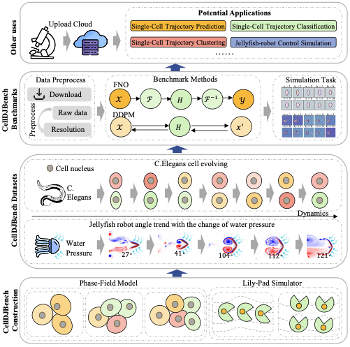
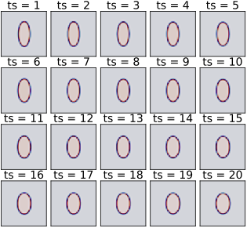
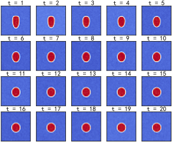
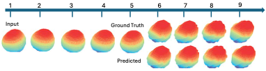
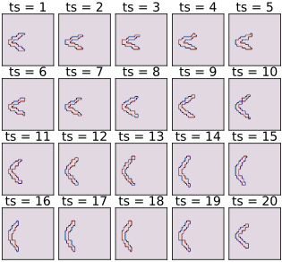

# CellDJBench: Benchmark Datasets for Data-Driven Biological Fluid Simulation
We introduces four large-scale datasets—**[Tension](https://drive.google.com/file/d/172rCACV0KUJvG54v9gY3l91VKQGOy-1Q/view?usp=sharing ), [Wets](https://drive.google.com/file/d/172rCACV0KUJvG54v9gY3l91VKQGOy-1Q/view?usp=sharing), [CellDivision](https://drive.google.com/file/d/1Q7SPErPPXqvQiYPDc4c_EPMXqg36RSeo/view?usp=sharing), and [Jellyfish](https://drive.google.com/file/d/1Pau0z2cpFzPJamkwqByaJoPUgCgiL53O/view?usp=drive_link )**—designed to address limitations in current biological fluid simulations, which often lack dynamic data and are constrained by small scales. These datasets cover diverse biological fluid dynamics scenarios and integrate physical modeling techniques like the phase-field method. By providing standardized benchmarks for data-driven approaches, they enable objective evaluation, reproducibility, and comparability across studies. The datasets aim to foster collaboration and progress in developing accurate, efficient models for simulating complex biological fluids, inviting active engagement from the research community.  
<p align="center">
  
</p>

# Data Download
| Datasets      | Dimension | Type-Physics       | Channels | Resolution     | Time steps | Size  | Videos  | Images  |
|---------------|-----------|--------------------|----------|----------------|------------|-------|---------|---------|
| Tension       | 3D        | Cell evolving      | 1        | 256 × 256      | 20         | ~500G | 60,000  | 1,200,000 |
| Wets          | 3D        | Cell evolving      | 1        | 256 × 256      | 20         | ~500G | 60,000  | 1,200,000 |
| CellDivision  | 4D        | Cell evolving      | 1        | 60 × 120 × 80  | 7-20       | ~320G | 300     | 4,000     |
| Jellyfish     | 3D        | Jellyfish-Robot    | 3        | 256 × 256      | 20         | ~10G  | 500     | 10,000    |
| **Summary**   | -         | -                  | -        | -              | -          | ~1.3T | **120,800** | **2,414,000** |

We have provided a Google Drive link to download the relevant dataset：[Tension](https://drive.google.com/drive/folders/1fy5C3RQeIQLk-AM19Zyoo93cy4RZ44D1?usp=sharing ), [Wets](https://drive.google.com/drive/folders/1x4wRied55wqdu31JKgiAk1p6CppAhhDJ?usp=sharing), [CellDivision](https://drive.google.com/file/d/1Q7SPErPPXqvQiYPDc4c_EPMXqg36RSeo/view?usp=sharing), and [Jellyfish](https://drive.google.com/file/d/1Pau0z2cpFzPJamkwqByaJoPUgCgiL53O/view?usp=drive_link ).

# Data Details
## Tension
The Tension dataset focuses on studying the evolution of a system’s shape in a 3D environment by adjusting parameters like tension. The dataset tracks the changes in the variable $\phi$ over time on a two-dimensional spatial grid, offering 2,500 videos and 50,000 images with a resolution of 256x256 pixels across 20 time steps. This data is crucial for understanding cellular dynamics, with applications in medicine, genetics, and developmental biology. It enables analysis of cell behavior, morphological changes, and the impact of external factors.

Unlike existing datasets, our dataset captures the dynamic nature of cell evolution, highlighting the relationship between cell shape and tension. It also records single-cell trajectory changes, supporting research in trajectory classification and clustering. The dataset’s scale makes it valuable for foundational models and large-scale research. Additionally, its high resolution opens up opportunities for detailed analysis in future high-resolution tasks.
<p align="center">
  
</p>

## Wets
The Wetting dataset explores system morphology changes under different conditions, such as tension, adhesion, and various physical parameters, through simulated data. By systematically adjusting these factors, researchers can analyze wetting behavior and its underlying mechanisms. The dataset offers 256x256 resolution images, documenting single-cell behavior, particularly changes in adhesion, and has potential for advancing research in single-cell trajectory prediction and clustering.

This large-scale dataset supports foundational models and opens new avenues for research in cellular dynamics. Its high resolution also allows for precise analysis, making it useful for detailed tasks like single-cell trajectory inference and metabolomics.
<p align="center">
  
</p>

## CellDivision
The CellDivision dataset, created using MATLAB and Finite Difference Method (FDM) simulations, models cell growth and division under natural conditions. It captures stochastic cell dynamics, including division events, mechanical properties, and trajectories on a 3D grid with a spatial resolution of $dx = 0.5$ and time step of $dt = 1$. Randomized values for division axes, volumes, and lifespans are generated, with parameters $\sigma = 0$ and $c = 2$ regulating mechanical characteristics. This high-resolution dataset is provided in CSV format for detailed analysis of cell behavior and dynamics.

The dataset offers detailed temporal and spatial data on cell lineages, fates, and environmental conditions, closely mirroring experimental data. It provides a valuable tool for validating analytical methods, testing hypotheses, and developing predictive models of cell division.

Future extensions could include additional cell types, varied environmental conditions, and gene expression data, further enhancing its value for biological research.
<p align="center">
  
</p>

## Jellyfish
The Jellyfish dataset, generated using the Lily-Pad simulator, captures jellyfish locomotion in a 3D environment through simulations on a $128\times128$ 2D flow field grid. The jellyfish’s wings, modeled as ellipses, are controlled by a signal determining their opening angle, following a cosine trajectory over 600 time steps. The dataset includes PDE states, opening angles, boundary points, and image-like boundary representations, consisting of 500 videos and 10,000 images. It provides a valuable resource for studying aquatic locomotion, biomimetics, robotics, and marine biology.

This dataset offers insights into the relationship between jellyfish-robot dynamics and water pressure, with potential applications in underwater robot design and control. Its large scale supports foundational model research, opening new avenues for exploring jellyfish-robot interactions.

Future applications include advancing underwater autonomous vehicle design and control, with the dataset’s high resolution and comprehensive data enhancing its impact across various scientific domains.
<p align="center">
  
</p>

## Baseline Models

```bash
cd code
python fno_wet.py
python sfno_wet.py
python fno_jelly.py
python sfno_jelly.py
```
